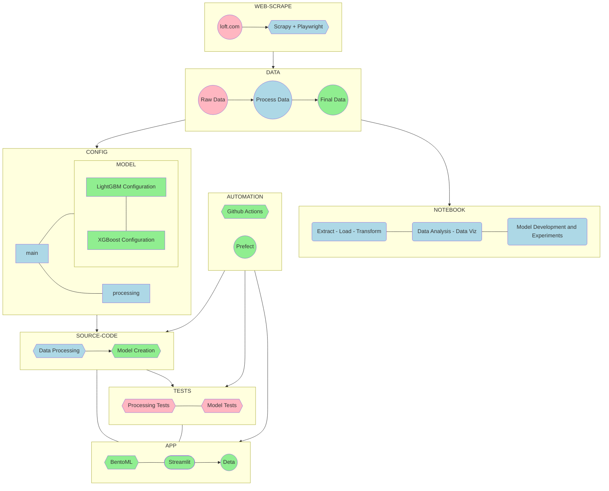

# Real-State-Prices

Real State Prices is a project that aims to develop a web application to **predict both rent and aquisition values for real state properties** based on the following features:

- Property type (house or apartment)
- Address
- Property footage
- Number of bedrooms
- Number of parking spaces

---

